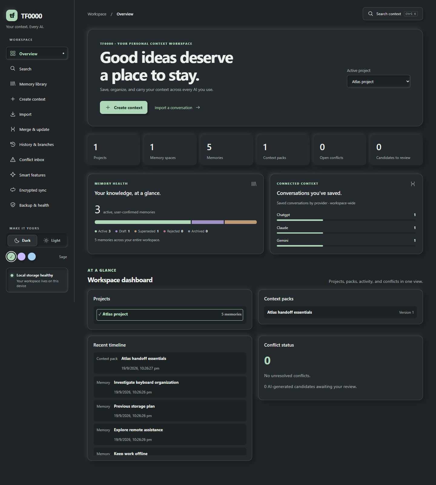
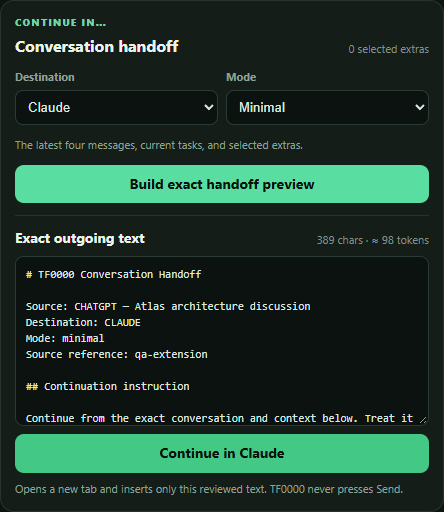
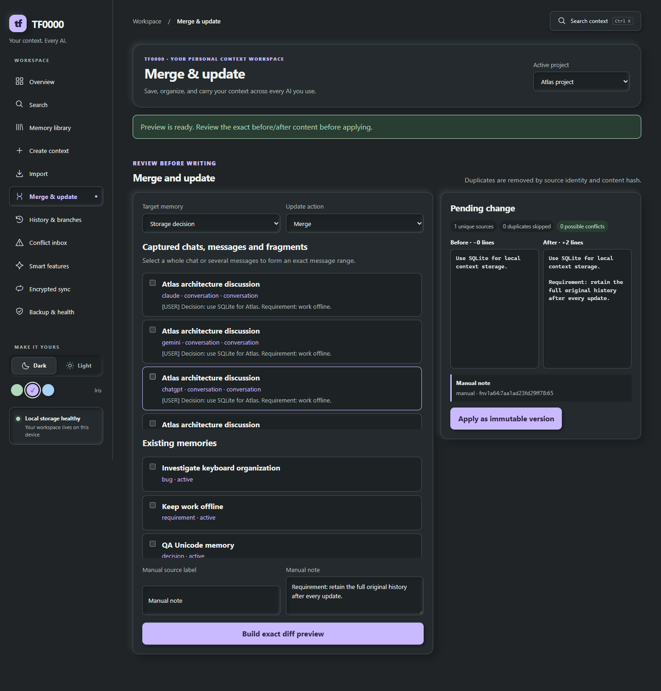

# Using TF0000

TF0000 saves context on your device so you can reuse it across AI conversations. Start with the [installation steps](../README.md#installation), then use a sample project while learning. Current [limitations](KNOWN_LIMITATIONS.md) affect some permissions, imports, and sync behavior.

## Understand your workspace

| Term | What it means |
| --- | --- |
| Project | A body of work, such as a website, research topic, or client project |
| Space | A folder-like group of related memories, which can be nested |
| Memory | Reusable information: a decision, requirement, fact, preference, or note |
| Source / evidence | The recorded material supporting a memory |
| Context Pack | An ordered selection of memories prepared for reuse |
| Conversation | Captured messages from an external AI chat |
| Candidate | Suggested memory content waiting for your review |

## Start in the desktop

1. Run `pnpm dev` from the repository root.
2. Create a project, then create a space such as **Requirements** or **Decisions**.
3. Create a memory with a clear title and specific content. Choose the correct type and review its status before saving.
4. Open the memory library to inspect it. The library can show memories across projects, so check the project on each item.
5. Use the appearance controls to switch between dark and light mode or change the accent colour.

The overview shows local record counts and recent activity. These are not AI-provider token usage or billing figures.

## Save useful material from a chat

Install the [browser extension and native host](browser-extension.md), then reload your ChatGPT, Claude, or Gemini tab.

1. Open TF0000 from the browser toolbar and choose **Run diagnostics**.
2. Select text on the page and choose **Save selection**, or use **Save messages** / **Save visible chat** for a larger capture.
3. Review what was saved. Capturing visible content may not include messages the provider has not loaded into the page.
4. For another website, use **Manual capture / import** and paste the source material yourself.

Captured conversations and reusable memories are separate records. Use the desktop merge workflow or candidate review to turn useful source material into a memory. Browser capture does not currently offer full chat-to-project assignment.

## Continue in another AI tool

1. In a supported conversation, open **Continue in…** in TF0000.
2. Choose the destination and select full, minimal, or custom mode.
3. Choose **Build exact handoff preview**.
4. Read the exact text and its character/token estimate. Remove anything you do not want the destination service to receive.
5. Choose **Continue in** for the selected destination.
6. Inspect the destination composer. If TF0000 used the clipboard fallback, paste the text manually. Send the message when ready.

The token count is an estimate. TF0000 does not send the prompt automatically, and a successful transfer does not guarantee the destination model's answer.

## Reuse a pack or preset

Use the browser extension to build a Context Pack containing memories; the desktop currently creates only an empty pack container.

1. Choose the memories to include and arrange their order.
2. Select full, summary, or reference mode for each item, then save the pack.
3. Select the pack when composing outgoing context and inspect the preview.
4. Save a selection preset when you want to reuse the same combination later.

Browser-created packs are global. If you use selective portable export, include global context deliberately to transfer those packs. Full pack contents/history restoration is not available yet.

## Control context for a conversation

Under **Per-chat context**, enable or disable memories and spaces. Temporary attachments let you choose one or a fixed number of insertions.

Counters decrease after successful insertion, not after a preview or clipboard fallback. They do not observe whether you actually send the prompt. Automatic time-based expiry is incomplete, so remove sensitive temporary items explicitly after use.

## Search and inspect evidence

1. Open **Search**, or press `Ctrl+K` in the desktop.
2. Enter a distinctive phrase and narrow the available filters.
3. Open a result to inspect its source and current status.
4. Try **Ask Memory** for evidence retrieval. An unknown query should return **Not recorded** rather than inventing an answer.

Desktop search returns up to 50 results without pagination. Refine your query if a result is missing.

## Merge and restore

1. Open **Merge & update** and choose a target memory.
2. Select source chats, messages, fragments, or memories; add a manual note if needed.
3. Build the diff preview and read the before/after content and listed sources.
4. Apply the update only when it expresses the intended change.
5. Open **History & branches** to inspect versions, restore previous content, or experiment with a branch.

The ordinary conflict inbox can mark a conflict resolved, but this does not automatically edit contradictory source memories. Review and update those records separately.

## Review local smart suggestions

Open **Smart Features** to select Off or Local CPU behavior, rebuild the optional similarity index, or run the local benchmark. Generated summaries are separate from the source. Inspect candidate memories and accept only useful suggestions; accepted candidates are drafts requiring further review.

These helpers use deterministic extraction and feature hashing. Configuring a remote provider does not currently call that provider's model.

## Back up, import, and restore

Use **Backup, restore, and health** to create a `.db` backup outside the application's data directory and inspect database integrity. A database backup is the appropriate choice for full local recovery; JSON/Markdown exports and sync snapshots omit parts of the workspace.

For imports, preview the file immediately before confirming and do not change it between those steps. The current import flow does not bind approval to the exact previewed bytes.

Before restoring, make a separate backup. Follow [migration and recovery](migration-recovery.md); preserve recovery files if anything fails.

## Use editor, agent, and device integrations

- [VS Code / Copilot](vscode-extension.md): map a workspace, save code references, retrieve context, and review suggested memories.
- [MCP](mcp-server.md): configure a local server and explicit client identity. Read the project-isolation limitation before connecting sensitive projects.
- [Encrypted sync](encrypted-sync.md): publish selected portable data to a shared folder and review divergent versions. Test on disposable data and retain independent backups.

## Troubleshooting

| Problem | What to check |
| --- | --- |
| Browser cannot reach storage | Rebuild the host, register the exact extension ID for your browser, and restart the browser |
| Adapter is unavailable | Reload the supported AI page and run diagnostics; use manual capture if its layout has changed |
| Text did not appear in the destination | Read the status message and paste the clipboard fallback if reported |
| VS Code cannot find the host | Run **TF0000: Configure Native Host Path** and select the built executable |
| Sync cannot decrypt | Check the passphrase; there is no passphrase-recovery service |
| A save fails | Record the error; a known issue can clear the form, so retain a copy of longer input |
| Database cannot open | Preserve the store and backups, then follow the recovery guide |

See [known limitations](KNOWN_LIMITATIONS.md) for remaining edge cases and [CONTRIBUTING.md](../CONTRIBUTING.md) for reporting a reproducible problem.
